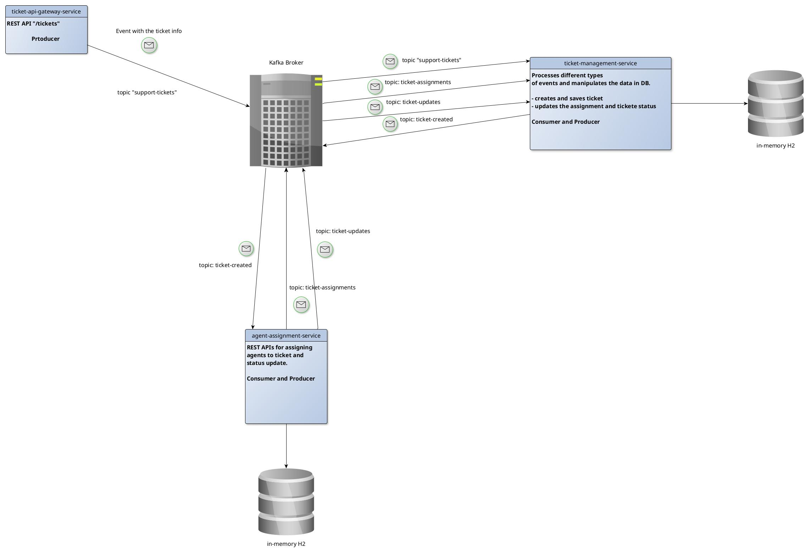

# Sporty Group Ticketing System

This project implements a microservices-based ticketing system designed to manage customer support tickets, facilitate agent assignments, and track ticket status updates efficiently. It leverages Spring Boot for service development, Kafka for inter-service communication, and Docker for containerized deployment.

## 1. Project Overview

The Sporty Group Ticketing System is composed of three core Spring Boot microservices, orchestrated to work together via Apache Kafka:

* **Ticket API Gateway Service:** Acts as the entry point for external clients, handling API requests related to ticket creation and status updates. It publishes events to Kafka.

* **Ticket Management Service:** Manages the lifecycle and state of tickets. It consumes events from Kafka to update ticket information and provides internal APIs for ticket data.

* **Agent Assignment Service:** Responsible for assigning tickets to available agents. It consumes ticket creation events and publishes ticket assignment events.

**Key Technologies Used:**

* **Spring Boot:** For building robust, standalone, production-ready Spring applications.

* **Apache Kafka:** A distributed streaming platform used for asynchronous, event-driven communication between services.

* **H2 Database:** An in-memory relational database used by individual services for local data storage.

* **Docker & Docker Compose:** For containerization and simplified multi-service deployment.

* **Maven:** Project build automation tool.

* **Java 17:** The primary programming language and runtime environment.

## 2. Setup and Run Instructions

### Prerequisites

Ensure you have the following software installed on your development machine:

* **Docker and Docker Compose:** For building and running the services in containers.

* **Java 17 Development Kit (JDK):** Required for local development and building the Maven project. Eclipse Temurin JDK is recommended.

* **Apache Maven:** For managing project dependencies and building the application.

### Project-Specific Requirements

* **Java Version:** All services are built and run with Java 17 (using Eclipse Temurin base images in Dockerfiles).

* **Kafka & Zookeeper:** These are essential for inter-service messaging and are included as services within the `docker-compose.yml`. Kafka runs on port `9092` and Zookeeper on `2181`.

* **H2 Database:** Each service utilizes an in-memory H2 database for its data. No persistent storage is required or configured for these databases, meaning data will be lost upon container shutdown.

### Environment Variables

Each service is configured with sensible default environment variables. These can be overridden at runtime via Docker Compose or when running locally.

* **Ticket API Gateway Service**

  * `SPRING_PROFILES_ACTIVE` (default: `docker`)

  * `SERVER_PORT` (default: `8080`)

  * `SPRING_KAFKA_BOOTSTRAP_SERVERS` (default: `kafka:9092`)

* **Ticket Management Service**

  * `SPRING_PROFILES_ACTIVE` (default: `docker`)

  * `SERVER_PORT` (default: `8081`)

  * `SPRING_KAFKA_BOOTSTRAP_SERVERS` (default: `kafka:9092`)

  * `SPRING_DATASOURCE_URL` (default: `jdbc:h2:mem:ticketdb`)

  * `SPRING_DATASOURCE_USERNAME` (default: `sa`)

  * `SPRING_DATASOURCE_PASSWORD` (default: `password`)

* **Agent Assignment Service**

  * `SPRING_PROFILES_ACTIVE` (default: `docker`)

  * `SERVER_PORT` (default: `8082`)

  * `SPRING_KAFKA_BOOTSTRAP_SERVERS` (default: `kafka:9092`)

  * `SPRING_DATASOURCE_URL` (default: `jdbc:h2:mem:agents-db`)

  * `SPRING_DATASOURCE_USERNAME` (default: `sa`)

  * `SPRING_DATASOURCE_PASSWORD` (default: empty)

You can override these defaults by creating `.env` files within each service's directory (e.g., `agent-assignment-service/.env`) and uncommenting the `env_file` lines in the `docker-compose.yml`.

### Exposed Ports

The following ports are exposed to the host machine for direct access:

* **Ticket API Gateway Service:** `8080`

* **Ticket Management Service:** `8081`

* **Agent Assignment Service:** `8082`

* **Kafka (Broker):** `9092`

* **Zookeeper:** `2181`

### Building and Running the Project

#### Using Docker Compose (Recommended)

This method builds Docker images for all services and starts them, along with Kafka and Zookeeper, in a containerized environment. All services communicate internally via the `app-net` Docker network.

1.  **Build and start all services:**

    ```bash
    docker compose up -d --build
    ```

    (Use `docker-compose` instead of `docker compose` for older Docker Compose versions.)

2.  **To stop all running containers:**

    ```bash
    docker compose down
    ```

3.  **To stop containers and remove associated volumes (e.g., for a clean slate):**

    ```bash
    docker compose down -v
    ```

#### Running Locally for Development

To run the services directly on your local machine for development purposes:

1.  **Start Kafka and Zookeeper using Docker Compose:**

    ```bash
    docker compose up -d kafka zookeeper
    ```

2.  **For each Spring Boot service**, navigate to its respective directory (e.g., `ticket-api-gateway-service`) and run the application using the Maven wrapper:

    ```bash
    cd ticket-api-gateway-service
    ./mvnw spring-boot:run
    ```

    Repeat this for `ticket-management-service` and `agent-assignment-service`.

## 3. API Endpoints

The primary API endpoints are exposed by the **Ticket API Gateway Service** on port `8080`. Detailed API documentation (e.g., Swagger UI) would typically be available at `/swagger-ui.html` if configured.

**Example Endpoints (illustrative - actual paths may vary):**

* **Create a new ticket:** `POST /api/tickets`

* **Get all tickets:** `GET /api/tickets`

* **Get ticket by ID:** `GET /api/tickets/{ticketId}`

* **Update ticket status:** `PUT /api/tickets/{ticketId}/status`

**H2 Console Access:**
For services using H2 in-memory databases (Ticket Management Service, Agent Assignment Service), you can access their respective H2 consoles if enabled in their `application.properties`/`application.yaml`:

* **Ticket Management Service H2 Console:** `http://localhost:8081/h2-console`

  * JDBC URL: `jdbc:h2:mem:ticketdb`

  * User Name: `sa`

  * Password: `password`

* **Agent Assignment Service H2 Console:** `http://localhost:8082/h2-console`

  * JDBC URL: `jdbc:h2:mem:agents-db`

  * User Name: `sa`

  * Password: (empty)

## 4. Message Formats Used

The services communicate asynchronously using Apache Kafka. The following key event message formats are exchanged:

### Ticket Created Event

Published by the **Ticket API Gateway Service** when a new support ticket is successfully created.
**Kafka Topic:** `ticket-created-events` (or similar)

```json
{
  "ticketId": "uuid-string",
  "subject": "Login problem",
  "description": "Cannot reset my password",
  "status": "OPEN",
  "userId": "user-001",
  "assigneeId": null,
  "createdAt": "2023-05-15T10:30:00Z",
  "updatedAt": "2023-05-15T10:30:00Z"
}
```
### Ticket Assigned Event

Published by the **Agent Assignment Service** once a ticket has been assigned to an agent.
**Kafka Topic:** `ticket-assigned-events` (or similar)

```json
{
  "ticketId": "uuid-string",
  "assigneeId": "agent-uuid-string"
}
```

## 5. Tests Included

This project adopts a comprehensive testing strategy, including both unit and integration tests for each microservice to ensure reliability and correctness.

### Unit Tests

Unit tests focus on individual components in isolation, verifying their logic and behavior.

* **Controller Tests:** Utilize Spring MockMvc to test REST API endpoints without starting a full server.

* **Service Layer Tests:** Employ Mockito for mocking dependencies and testing business logic.

* **Repository Tests:** Test database interactions using the H2 in-memory database.

* **Event Serialization/Deserialization Tests:** Verify that Kafka message formats are correctly handled.

### Integration Tests

Integration tests validate the interactions between different components and services, including external dependencies like Kafka and databases.

* **End-to-End Tests:** Use Testcontainers to spin up real Kafka instances for robust event processing tests.

* **API Endpoint Tests:** Comprehensive tests for the exposed REST APIs.

* **Event Processing Tests:** Verify that services correctly consume and produce Kafka events.

* **Database Interaction Tests:** Ensure data persistence and retrieval are working as expected.

### Running Tests

* **To run only unit tests:**

    ```bash
    mvn test
    ```

* **To run both unit and integration tests:**

    ```bash
    mvn verify -P integration-test
    ```

  (Note: `mvn verify` is typically used for integration tests as it runs all phases up to `verify`, including `integration-test` if the profile is activated.)

## 6. AI Tool Usage and Validation

This project's development process has been augmented by various AI-powered tools to enhance productivity, code quality, and problem-solving.

**AI Tools Utilized During Development:**

* **Junie (IntelliJ Feature):** Used for code generation, refactoring suggestions, and general coding assistance within the IntelliJ IDEA environment.

* **Google Gemini:** Employed for complex problem-solving, architectural discussions, debugging assistance, and generating documentation/explanation content.

* **Ask Gordon (Docker Desktop Feature):** Utilized for Dockerfile optimization, Docker Compose configuration, and troubleshooting containerization issues.

### Validation Steps

The correctness and functionality of the system, including aspects influenced by AI tools, are validated through a multi-layered approach:

1.  **Unit Tests:** Comprehensive unit tests verify the integrity and correctness of individual code components.

2.  **Integration Tests:** End-to-end integration tests confirm that all services interact correctly and that the overall system behaves as expected in a near-production environment.

3.  **Manual Testing with Swagger UI:** Direct interaction with the API Gateway via Swagger UI (if enabled) allows for quick manual verification of endpoint functionality.

4.  **Docker Compose Deployment:** The use of Docker Compose ensures a consistent and reproducible deployment environment, helping to validate that the application runs correctly in a containerized setup.

## 7. Ticketing system services

* **System Architecture Diagram:** The following diagram illustrates the architecture and interaction between the different services in the Sporty Group Ticketing System:


